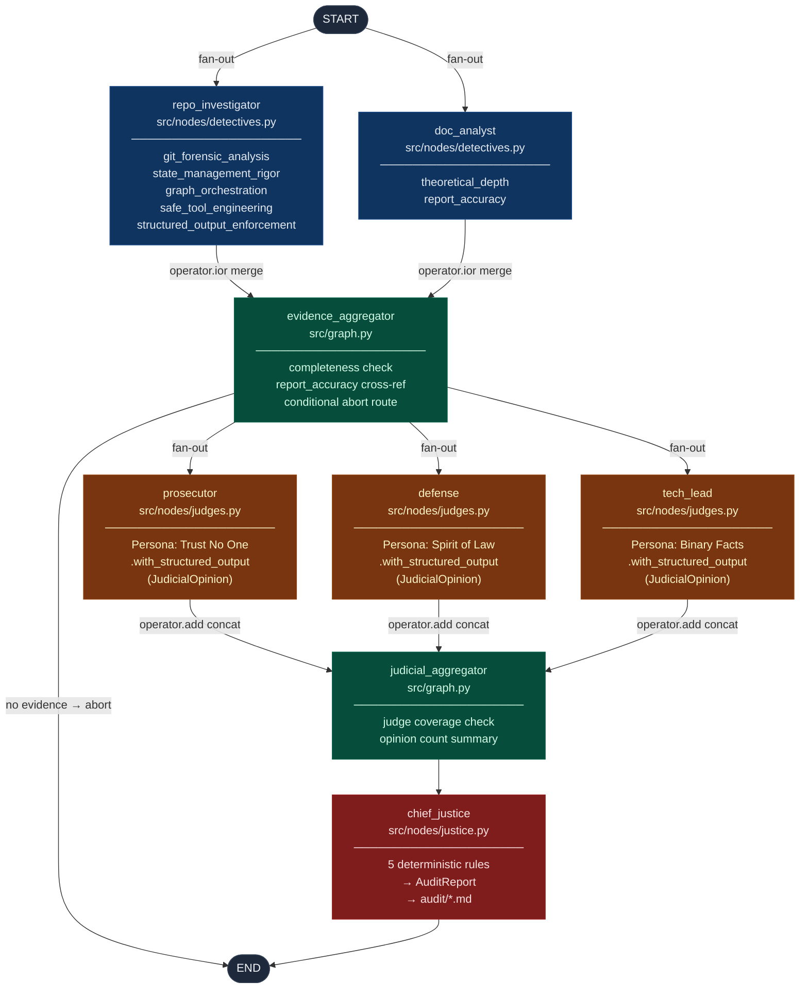

# Automaton Auditor — The Digital Courtroom

> An autonomous, hierarchical multi-agent system that accepts a GitHub repository and an architectural PDF, prosecutes the submission through forensic analysis and dialectical judicial review, and delivers a final `AuditReport` with specific, file-level remediation instructions.

---

## Table of Contents

1. [Project Overview](#1-project-overview)
2. [Architecture](#2-architecture)
3. [Senior-Level Features](#3-senior-level-features)
4. [Installation & Setup](#4-installation--setup)
5. [Usage](#5-usage)
6. [Repository Structure](#6-repository-structure)
7. [Observability](#7-observability)

---

## 1. Project Overview

The central challenge of AI-native software engineering is not code *generation* — it is code *governance*. As autonomous agents produce features at machine speed, manual pull-request review cannot scale. The Automaton Auditor addresses this directly.

The system operates as a **Digital Courtroom**: a hierarchical LangGraph `StateGraph` with two parallel execution tiers that evaluate a GitHub submission from multiple adversarial viewpoints before a deterministic Chief Justice renders a binding verdict.

| Layer | Nodes | Role |
|---|---|---|
| **Detective Layer** | `repo_investigator`, `doc_analyst` | Collect verifiable facts from code and PDF |
| **Judicial Layer** | `prosecutor`, `defense`, `tech_lead` | Render adversarial opinions on the evidence |
| **Supreme Court** | `chief_justice` | Apply deterministic rules to synthesize a final score |

---

## 2. Architecture

### Full Graph Topology



### State Reducers — Why Parallel Branches Are Safe

All inter-node communication flows through a single typed `AgentState` (`src/state.py`). Two `Annotated` reducer fields make concurrent writes non-destructive:

| Field | Reducer | Used by | Guarantee |
|---|---|---|---|
| `evidences` | `operator.ior` (dict merge) | Detective nodes | Each detective writes disjoint criterion keys; no overwrite possible |
| `opinions` | `operator.add` (list concat) | Judge nodes | Each judge appends its list; all opinions accumulate |

### Chief Justice Synthesis Rules

The `chief_justice_node` applies five named, deterministic rules in strict priority order — no LLM call:

| Priority | Rule | Trigger | Effect |
|---|---|---|---|
| 1 | `security_override` | Prosecutor score ≤ 2 + security keyword in argument | Cap final score at `min(3, TechLead score)` |
| 2 | `fact_supremacy` | All `evidence.found=False` AND Defense score inflated | Overrule Defense; average Prosecutor + TechLead |
| 3 | `functionality_weight` | `graph_orchestration` criterion AND TechLead score ≥ 4 | TechLead carries 50% weight |
| 4 | `variance_re_evaluation` | Score variance > 2 | TechLead score becomes the binding arbiter |
| 5 | `default_weighted_avg` | Default (no rule triggered) | TechLead 40% + Prosecutor 30% + Defense 30% |

A **dissent summary** is mandatory for any criterion where `max(scores) − min(scores) > 2`.

---

## 3. Senior-Level Features

### Forensic Accuracy via AST

The `RepoInvestigator` (`src/tools/repo_tools.py`) uses `ast.parse()` + `ast.walk()` rather than regex. This matters because:

- A regex for `"StateGraph"` passes on a file that imports but never instantiates it
- A regex for `"operator.ior"` cannot confirm the reducer is inside an `Annotated` type hint vs. a plain import

The AST walk identifies `StateGraph` instantiation, extracts `add_edge` / `add_conditional_edges` calls as typed `EdgeCall` models, derives a `ParallelismReport` (fan-out confirmed by ≥2 edges from the same source), and reports `is_purely_linear` when no fan-out exists.

### Thread-Safe State Management

`AgentState` uses `operator.ior` (dict merge) and `operator.add` (list concat) as LangGraph reducers. When `repo_investigator` and `doc_analyst` execute concurrently, LangGraph merges their `evidences` updates rather than overwriting — guaranteed non-destructive because each detective writes to disjoint criterion keys.

### Dialectical Judicial Review

Three judge personas are deliberately designed to produce **conflicting verdicts** on the same evidence:

- **Prosecutor** — "Trust No One. Assume Vibe Coding." Penalises every gap. Score 5 is nearly impossible.
- **Defense** — "Spirit of the Law." Rewards iterative git history and architectural intent even in incomplete submissions.
- **Tech Lead** — Binary facts only. Either `operator.ior` is in an `Annotated` hint or it is not. Ignores the struggle narrative.

Conflict is resolved by the Chief Justice's deterministic rules, not by averaging or re-prompting.

### Structured Output Enforcement

Every Judge LLM call is bound via `.with_structured_output(JudicialOpinion)`, forcing the model to return JSON that passes Pydantic validation. Malformed responses trigger a retry (up to 3 attempts, 2 s back-off) before the opinion is omitted. The `Literal["Prosecutor", "Defense", "TechLead"]` field type on `JudicialOpinion.judge` makes it impossible for a judge to hallucinate a fourth persona.

### Sandboxed Tool Engineering

Every git clone runs inside a `tempfile.TemporaryDirectory` context manager. The directory is guaranteed to be deleted on exit — even on exception. All subprocess calls use explicit argument lists (`["git", "clone", "--depth", "100", url, str(dest)]`) with `check=True` and `capture_output=True`. There are zero `os.system()` calls; the self-audit `ToolSafetyReport` verifies this programmatically via AST scan.

### RAG-Lite PDF Forensics

`DocumentAuditor` (`src/tools/doc_tools.py`) ingests PDFs via `docling`'s `DocumentConverter`, then applies a substantiveness heuristic to distinguish between genuine architectural explanation and keyword-dropping. A term occurrence is only classified as `in_substantive_context=True` if its containing paragraph also contains at least one verb from `_SUBSTANTIVE_VERBS`. A sentence that reads *"Our system uses Dialectical Synthesis"* without further explanation is flagged as keyword-dropping.

---

## 4. Installation & Setup

This project uses `uv` for dependency management.

**1. Install `uv`:**

```bash
# macOS / Linux
curl -LsSf https://astral.sh/uv/install.sh | sh

# Windows
powershell -ExecutionPolicy ByPass -c "irm https://astral.sh/uv/install.ps1 | iex"
```

**2. Clone and sync dependencies:**

```bash
git clone <your-repo-url>
cd automation-auditor
uv sync
```

**3. Configure environment variables:**

```bash
cp .env.example .env
```

Populate `.env`:

```env
GOOGLE_API_KEY=<your-gemini-api-key>
LANGCHAIN_API_KEY=<your-langsmith-api-key>
LANGCHAIN_TRACING_V2=true
```

| Variable | Required | Purpose |
|---|---|---|
| `GOOGLE_API_KEY` | Yes | Gemini model access for Judge nodes |
| `LANGCHAIN_API_KEY` | Recommended | LangSmith trace streaming |
| `LANGCHAIN_TRACING_V2` | Recommended | Enable automatic graph tracing |

---

## 5. Usage

### Run a Full Audit

```bash
uv run python -c "
from src.graph import run_full_audit
result = run_full_audit(
    repo_url='https://github.com/target-user/target-repo',
    pdf_path='path/to/architectural_report.pdf',
)
print(f'Overall score: {result[\"final_report\"].overall_score}/5.0')
"
```

The audit report is automatically written to `audit/<repo-name>_<timestamp>UTC.md`.

### Programmatic Usage

```python
from src.graph import build_graph, create_initial_state

graph = build_graph()

state = create_initial_state(
    repo_url="https://github.com/target-user/target-repo",
    pdf_path="reports/submission.pdf",
)

result = graph.invoke(state)

# Access structured results
print(result["final_report"].overall_score)          # e.g. 3.75
print(result["final_report"].executive_summary)
for criterion in result["final_report"].criteria:
    print(f"{criterion.dimension_name}: {criterion.final_score}/5")
```

### What the Audit Covers

| Criterion | Artifact | Detective |
|---|---|---|
| Git Forensic Analysis | GitHub repo | RepoInvestigator |
| State Management Rigor | GitHub repo | RepoInvestigator |
| Graph Orchestration Architecture | GitHub repo | RepoInvestigator |
| Safe Tool Engineering | GitHub repo | RepoInvestigator |
| Structured Output Enforcement | GitHub repo | RepoInvestigator |
| Theoretical Depth | PDF report | DocAnalyst |
| Report Accuracy (Cross-Reference) | PDF report + repo | DocAnalyst + EvidenceAggregator |

---

## 6. Repository Structure

```text
automaton-auditor/
├── .env.example                  # GOOGLE_API_KEY, LANGCHAIN_TRACING_V2, LANGCHAIN_API_KEY
├── pyproject.toml                # uv-managed; langgraph, pydantic, langchain-google-genai, docling
├── rubric/
│   └── rubric.json               # Machine-readable rubric v3.0.0 — 7 dimensions, 5 synthesis rules
├── audit/                        # Generated audit reports (created at runtime)
│   └── <repo>_<timestamp>UTC.md  # Final AuditReport per run
├── reports/
│   └── interim_report.md         # Week 2 interim architectural report
└── src/
    ├── state.py                  # AgentState, Evidence, JudicialOpinion, CriterionResult, AuditReport
    ├── graph.py                  # build_graph(), evidence_aggregator_node, judicial_aggregator_node
    ├── nodes/
    │   ├── detectives.py         # repo_investigator_node, doc_analyst_node
    │   ├── judges.py             # prosecutor_node, defense_node, tech_lead_node
    │   └── justice.py            # chief_justice_node (deterministic synthesis + Markdown serialiser)
    └── tools/
        ├── repo_tools.py         # RepoManager (sandbox), GraphForensics (AST), RepoInvestigator
        └── doc_tools.py          # DocumentAuditor (docling + HybridChunker + substantiveness heuristic)
```

---

## 7. Observability

The graph is instrumented for [LangSmith](https://smith.langchain.com/) tracing out of the box.

With `LANGCHAIN_TRACING_V2=true` set, every `graph.invoke()` call streams a full execution trace including:

- The parallel fan-out of detective nodes from `START`
- The `operator.ior` merge at `evidence_aggregator`
- The conditional routing decision (proceed or abort)
- The parallel fan-out of judge nodes
- The `operator.add` accumulation at `judicial_aggregator`
- The deterministic synthesis decisions in `chief_justice`

Each trace is tagged with `"detective-layer"`, `"judicial-layer"`, and `"final-submission"` and labeled `automaton-auditor | <repo-name>` for easy filtering.

To inspect a run:

1. Log in to [smith.langchain.com](https://smith.langchain.com/)
2. Navigate to the `automaton-auditor` project
3. Open the latest trace — the graph view shows both fan-out/fan-in patterns visually

---

> **A note on design philosophy:** The Automaton Auditor treats code evaluation as a legal proceeding. Detectives collect only verifiable facts. Judges argue from fixed adversarial positions. The Chief Justice resolves conflict through named, auditable rules — not vibes. The goal is a system that can explain *why* a score was assigned, not just *what* the score is.
