# Automaton Auditor — Interim Architectural Report

**Submission:** Week 2 Interim — Wednesday, 25 February 2026
**Author:** Automaton Auditor Project
**Repository:** `automaton-auditor`
**LangGraph Version:** ≥ 0.2.0  |  **Python:** ≥ 3.11

---

## Table of Contents

1. [Executive Summary](#1-executive-summary)
2. [Architectural Decisions & State Management](#2-architectural-decisions--state-management)
3. [Forensic Strategy — The Detective Layer](#3-forensic-strategy--the-detective-layer)
4. [Known Gaps & Planned Development](#4-known-gaps--planned-development)
5. [Graph Visualisation](#5-graph-visualisation)
6. [File Map](#6-file-map)

---

## 1. Executive Summary

### Mission

The central challenge of AI-native software engineering is not code _generation_ — it is code _governance_. As autonomous agents generate features at machine speed, the human review bottleneck shifts from "can we produce it?" to "can we trust it?". Manual pull-request review cannot scale to the output of hundreds of concurrent agents.

The Automaton Auditor addresses this directly. Its mission is to operate as a **Digital Courtroom**: an autonomous, hierarchical multi-agent system that accepts a GitHub repository URL and an architectural PDF report, prosecutes the submission through structured forensic analysis and dialectical judicial review, and produces a final `AuditReport` that provides specific, file-level remediation instructions.

### System Overview

The system is implemented as a **hierarchical LangGraph `StateGraph`** with three planned execution layers:

| Layer               | Nodes                                                             | Status                        |
| ------------------- | ----------------------------------------------------------------- | ----------------------------- |
| **Detective Layer** | `repo_investigator`, `doc_analyst`, _(future)_ `vision_inspector` | ✅ Implemented                |
| **Judicial Layer**  | `prosecutor`, `defense`, `tech_lead`                              | 🔲 Planned (final submission) |
| **Supreme Court**   | `chief_justice`                                                   | 🔲 Planned (final submission) |

All inter-node communication flows through a single typed `AgentState` TypedDict defined in [`src/state.py`](../src/state.py). No global variables, no shared mutable objects. The only state that exists is what LangGraph passes between nodes.

---

## 2. Architectural Decisions & State Management

### 2.1 Pydantic Models Over Plain Dicts

The rubric explicitly penalises what it calls **"Dict Soups"** — complex nested `dict[str, Any]` structures that provide no type guarantees and force every consumer to guess at key names and value shapes. Every data structure in this system is a Pydantic `BaseModel` or a typed `TypedDict`.

The Detective Layer output is a `Evidence` model ([`src/state.py:75`](../src/state.py)):

```python
class Evidence(BaseModel):
    model_config = ConfigDict(frozen=True)

    goal:        str
    found:       bool
    content:     Optional[str]
    location:    str            # e.g. "src/graph.py:42-68" or a commit hash
    rationale:   str
    confidence:  float          # ge=0.0, le=1.0
    criterion_id: str
```

`model_config = ConfigDict(frozen=True)` makes every `Evidence` instance **immutable** after construction. A Detective cannot retroactively alter evidence it has already recorded — an important invariant for an auditing system.

The Judicial Layer output is a `JudicialOpinion` model ([`src/state.py:122`](../src/state.py)):

```python
class JudicialOpinion(BaseModel):
    judge:           Literal["Prosecutor", "Defense", "TechLead"]
    criterion_id:    str
    score:           int          # ge=1, le=5  — validated by Pydantic
    argument:        str
    cited_evidence:  List[str]    # references to Evidence.goal or Evidence.location
```

The `Literal["Prosecutor", "Defense", "TechLead"]` type on `judge` means LangGraph will reject any `JudicialOpinion` where the judge field contains anything other than those three exact strings. This prevents a Judge node from hallucinating a fourth persona.

Using Pydantic for structured LLM output also satisfies the rubric's **"Hallucination Liability"** check: the Judge nodes will call the LLM with `.with_structured_output(JudicialOpinion)`, binding the model to return valid JSON that passes Pydantic's `__init__` validators. If it cannot, LangGraph raises a validation error — caught and retried — rather than silently passing malformed data downstream to the Chief Justice.

### 2.2 The AgentState TypedDict and Parallel State Reduction

The shared state that threads through the entire graph is `AgentState` ([`src/state.py:250`](../src/state.py)):

```python
class AgentState(TypedDict):
    repo_url:           str
    pdf_path:           str
    rubric_dimensions:  List[Dict[str, Any]]

    evidences:  Annotated[Dict[str, List[Evidence]], operator.ior]
    opinions:   Annotated[List[JudicialOpinion],    operator.add]

    final_report: Optional[AuditReport]
```

The two `Annotated` fields are the core of the parallel safety guarantee.

#### `operator.ior` — Dict Merge for the Detective Layer

When `repo_investigator_node` and `doc_analyst_node` execute concurrently, each returns a partial state update containing `{"evidences": {criterion_id: [Evidence, ...]}}`. Without a reducer, whichever node finishes second would silently overwrite the first node's output.

`operator.ior` (Python's `|=` for dicts) instructs LangGraph to **merge** these updates rather than replace them:

```
state["evidences"] |= repo_investigator_output["evidences"]
state["evidences"] |= doc_analyst_output["evidences"]
```

Because each detective writes to **disjoint criterion keys** — `repo_investigator` writes `git_forensic_analysis`, `state_management_rigor`, `graph_orchestration`, `safe_tool_engineering`, and `structured_output_enforcement`, while `doc_analyst` writes `theoretical_depth` and `report_accuracy` — the merge is non-destructive by design.

#### `operator.add` — List Concatenation for the Judicial Layer

When the three Judge nodes execute concurrently in the final submission, each returns `{"opinions": [JudicialOpinion(...)]}`. `operator.add` concatenates these lists rather than replacing them:

```
state["opinions"] = (
    prosecutor_output["opinions"]      # [JudicialOpinion(judge="Prosecutor", ...)]
    + defense_output["opinions"]       # [JudicialOpinion(judge="Defense", ...)]
    + tech_lead_output["opinions"]     # [JudicialOpinion(judge="TechLead", ...)]
)
```

When the Chief Justice node runs, `state["opinions"]` will contain exactly three `JudicialOpinion` objects per criterion — one from each judge — regardless of which node finished first. The `operator.add` reducer guarantees no opinion is lost.

---

## 3. Forensic Strategy — The Detective Layer

The Detective Layer philosophy: Detectives **never** assign scores or render opinions. Their only job is to collect verifiable facts and record them as `Evidence` objects. Opinions are the Judiciary's domain.

### 3.1 RepoInvestigator — AST-Based Code Forensics

The `RepoInvestigator` class ([`src/tools/repo_tools.py`](../src/tools/repo_tools.py)) orchestrates the `GraphForensics` utility class to run five forensic protocols against the target repository.

#### Why AST, Not Regex

The rubric explicitly distinguishes between two skill levels:

> _"Score 3: Can find exact graph definitions (e.g., StateGraph instantiation) using regex or simple parsing."_
> _"Score 5: Parses the AST to confirm LangGraph logic structure (not just regex matching)."_

A regex check for `"StateGraph"` passes on a file that imports but never instantiates it. A regex check for `"add_edge"` cannot distinguish between `builder.add_edge(START, "detective_1")` and a string in a comment. AST analysis has no such ambiguity.

`GraphForensics.analyze_state_file()` ([`src/tools/repo_tools.py:393`](../src/tools/repo_tools.py)) uses `ast.parse()` + `ast.walk()` to:

- Identify every `ast.ClassDef` node and classify it as `"BaseModel"`, `"TypedDict"`, or `"other"` by inspecting its `bases` list
- Walk each class body for `ast.AnnAssign` statements where the annotation's `ast.unparse()` contains `"operator.ior"` or `"operator.add"` — confirming the reducer is in an annotation, not just imported
- Return a typed `StateAnalysisResult` model containing every finding

`GraphForensics.analyze_graph_file()` ([`src/tools/repo_tools.py:437`](../src/tools/repo_tools.py)) applies a second AST walk to detect graph topology:

- Finds the variable bound to `StateGraph(...)` by matching `ast.Assign` nodes whose value is an `ast.Call` with function name `"StateGraph"`
- Extracts all `add_edge` and `add_conditional_edges` calls as typed `EdgeCall` models containing `(source, destination, lineno, is_conditional)`
- Derives a `ParallelismReport` by grouping edges by source node: any source with two or more destinations is a confirmed **fan-out**; any destination with two or more sources is a confirmed **fan-in**
- Reports `is_purely_linear=True` when no fan-out exists — the evidence for an "Orchestration Fraud" charge

#### Sandboxed Git Operations

The `RepoManager` class ([`src/tools/repo_tools.py:229`](../src/tools/repo_tools.py)) is a Python context manager that wraps every git operation in an isolated `tempfile.TemporaryDirectory`:

```python
class RepoManager:
    def __enter__(self) -> "RepoManager":
        self._tmpdir = tempfile.TemporaryDirectory(prefix="automaton_auditor_")
        self._root = Path(self._tmpdir.name)
        return self

    def __exit__(self, exc_type, exc_val, exc_tb) -> None:
        if self._tmpdir is not None:
            self._tmpdir.cleanup()
```

The `__exit__` method runs regardless of whether an exception occurred, ensuring the sandbox is always cleaned up. Cloned code from an untrusted repository never persists on disk beyond the `with` block.

All git commands use `subprocess.run()` with an **explicit argument list** (`["git", "clone", "--depth", "100", url, str(dest)]`), `check=True`, and `capture_output=True`. There are zero `os.system()` calls and no `shell=True` arguments in this module — the self-audit `ToolSafetyReport` verifies this programmatically via AST analysis.

URL validation (`_validate_repo_url()`) uses `urllib.parse.urlparse()` to reject non-`https`/`git` schemes before any subprocess call is made.

### 3.2 DocAnalyst — RAG-Lite PDF Forensics

The `DocumentAuditor` class ([`src/tools/doc_tools.py`](../src/tools/doc_tools.py)) follows an **ingest-once / query-many** lifecycle.

#### Ingestion and Chunking

`DocumentAuditor.ingest()` calls docling's `DocumentConverter` to parse the PDF into a `DoclingDocument`, then exports it to Markdown via `doc.export_to_markdown()`. The chunking pipeline attempts two strategies in order:

1. **Primary:** `HybridChunker` from `docling.chunking`, which produces semantically coherent chunks aligned to document structure (headings, paragraphs, list items). Each `DocumentChunk` captures an optional `page_number` and `heading` from docling's metadata.
2. **Fallback:** Plain paragraph splitting on blank lines, used when the docling chunker model weights are unavailable (e.g. in CI environments without internet access).

This degradation strategy means the DocAnalyst remains functional in offline test environments.

#### Substantiveness Heuristic — Detecting Keyword Dropping

The rubric's `theoretical_depth` criterion distinguishes between a candidate who _uses_ the term "Dialectical Synthesis" and one who _understands_ it. Simply searching for the presence of the string is insufficient.

`DocumentAuditor.search_term()` classifies each hit using `_is_substantive()` ([`src/tools/doc_tools.py:76`](../src/tools/doc_tools.py)):

```python
_SUBSTANTIVE_VERBS = frozenset({
    "implemented", "executes", "using", "through", "via",
    "because", "whereby", "enables", "fan-out", "fan-in",
    "parallel", "graph", "node", ...
})

def _is_substantive(text: str) -> bool:
    return any(indicator in text.lower() for indicator in _SUBSTANTIVE_VERBS)
```

A term occurrence is only classified as `in_substantive_context=True` if its containing paragraph also contains at least one word from `_SUBSTANTIVE_VERBS`. A paragraph that reads _"We implemented Dialectical Synthesis via three parallel judge personas"_ passes; a sentence that reads _"Our system uses Dialectical Synthesis"_ in an executive summary introduction does not.

`TermSearchResult.is_substantive` is `True` only when `substantive_count > 0`. When `total_count > 0` but `substantive_count == 0`, the finding is classified as **keyword-dropping** — evidence for a "Theoretical Depth" score of 2 rather than 4 or 5.

#### Cross-Reference Deferral

The `report_accuracy` rubric criterion requires cross-referencing file paths mentioned in the PDF against the actual repository structure. Because `doc_analyst_node` and `repo_investigator_node` run in **parallel**, the DocAnalyst cannot access the repo file listing at execution time.

The solution: DocAnalyst extracts all claimed paths using a regex over the full Markdown text and records them in `Evidence.content`. After the fan-in, `evidence_aggregator_node` in `src/graph.py` performs the secondary cross-reference using the `Evidence.location` fields accumulated from the RepoInvestigator's protocols as the authoritative file list.

---

## 4. Known Gaps & Planned Development

### 4.1 Judicial Layer — The Dialectical Bench

The Judicial Layer will introduce three Judge node functions in `src/nodes/judges.py`. Each node will receive the same `AgentState.evidences` dict and produce a `JudicialOpinion` for every rubric criterion.

The three Judge personas are deliberately designed to produce **conflicting verdicts**:

| Persona              | Core Philosophy                          | Prompting Strategy                                                                                                                                                                                                                                                                                                                           |
| -------------------- | ---------------------------------------- | -------------------------------------------------------------------------------------------------------------------------------------------------------------------------------------------------------------------------------------------------------------------------------------------------------------------------------------------- |
| **Prosecutor**       | _"Trust No One. Assume Vibe Coding."_    | Maximise scrutiny. If the evidence shows a linear pipeline where the rubric requires parallel execution, argue Score 1 and cite the specific `EdgeCall` objects from `GraphStructureReport`. If `ToolSafetyReport.uses_os_system=True`, charge "Security Negligence" and cap the `safe_tool_engineering` score regardless of effort.         |
| **Defense Attorney** | _"Reward Effort and Intent."_            | Examine `GitHistoryReport.has_progression`. If the commit history shows genuine iterative development — environment setup → tool engineering → graph wiring — argue for credit even where implementation is incomplete. Look at `Evidence.confidence` values: low confidence means the Detective was uncertain, not that the work is absent. |
| **Tech Lead**        | _"Does it compile? Is it maintainable?"_ | Ignore the struggle narrative. Evaluate `StateAnalysisResult.has_operator_ior`, `has_operator_add`, `has_pydantic_models` as binary facts. If `ParallelismReport.is_purely_linear=True`, apply the "Orchestration Fraud" precedent from the rubric.                                                                                          |

Each Judge will be invoked via `llm.with_structured_output(JudicialOpinion)`, binding the LLM to return output that satisfies the Pydantic schema. Malformed responses trigger a retry before propagating failure.

The three nodes will run in a second **parallel fan-out** from `evidence_aggregator` to a new `judicial_aggregator` fan-in, mirroring the Detective topology.

### 4.2 Synthesis Engine — The Chief Justice

`ChiefJusticeNode` (`src/nodes/justice.py`) will be the final non-terminal node before `END`. Its deliberation protocol is **deterministic Python logic**, not an LLM prompt — this is the key architectural distinction that separates a Score 5 implementation from a Score 3 one.

For each rubric criterion, the node groups `AgentState.opinions` by `criterion_id`, then applies synthesis rules loaded from `rubric/rubric.json`:

```python
# Deterministic rule: confirmed security violation caps score at 3
if any(
    "security" in op.argument.lower() and op.judge == "Prosecutor"
    for op in criterion_opinions
):
    final_score = min(3, tech_lead_score)

# Deterministic rule: score variance > 2 requires dissent summary
elif max_score - min_score > 2:
    dissent_summary = _build_dissent(prosecutor_op, defense_op, tech_lead_op)
    final_score = _apply_functionality_weight(tech_lead_score, defense_score)
```

The output is a `CriterionResult` per rubric dimension, collected into a final `AuditReport` whose `remediation_plan` field contains specific, file-level instructions. The `AuditReport` is then serialised to a Markdown file under `audit/`.

### 4.3 VisionInspector

`VisionInspector` (planned for `src/nodes/detectives.py`) will extract images from the PDF via docling and pass them to Gemini Pro Vision with a structured prompt asking whether the diagram shows a genuine LangGraph `StateGraph` with explicit parallel branches or a generic linear flowchart. This protocol covers the `swarm_visual` rubric criterion.

---

## 5. Graph Visualisation

### Interim Submission Graph (Implemented)

```mermaid
graph TD
    START([START]):::entry
    REPO["repo_investigator_node\nsrc/nodes/detectives.py\n───────────────────────\ngit_forensic_analysis\nstate_management_rigor\ngraph_orchestration\nsafe_tool_engineering\nstructured_output_enforcement"]:::detective
    DOC["doc_analyst_node\nsrc/nodes/detectives.py\n───────────────────────\ntheoretical_depth\nreport_accuracy ①"]:::detective
    AGG["evidence_aggregator_node\nsrc/graph.py\n───────────────────────\ncompleteness check\nsecondary cross-reference ②\nLangSmith summary log"]:::aggregator
    IEND["interim_end_node\n(Judicial Layer placeholder)"]:::terminal
    END_NODE([END]):::entry

    START -->|"fan-out"| REPO
    START -->|"fan-out"| DOC
    REPO -->|"evidences merged via operator.ior"| AGG
    DOC  -->|"evidences merged via operator.ior"| AGG
    AGG  --> IEND
    IEND --> END_NODE

    classDef entry      fill:#1e293b,color:#f1f5f9,stroke:#334155
    classDef detective  fill:#0f3460,color:#e2e8f0,stroke:#1e4d8c
    classDef aggregator fill:#064e3b,color:#d1fae5,stroke:#065f46
    classDef terminal   fill:#4a1942,color:#fce7f3,stroke:#6b21a8
```



> ① `report_accuracy` evidence at this stage contains only extracted path claims.
> ② The secondary cross-reference in `evidence_aggregator_node` completes the `report_accuracy` analysis using repo file locations harvested from the merged `state["evidences"]`.

### Target Final Submission Graph


---

## 6. File Map

```
automaton-auditor/
├── pyproject.toml          # uv-managed; langgraph, pydantic, langchain-google-genai, docling
├── .env.example            # GOOGLE_API_KEY, LANGCHAIN_TRACING_V2, LANGCHAIN_API_KEY
├── rubric/
│   └── rubric.json         # Machine-readable rubric v3.0.0 — 10 dimensions, 5 synthesis rules
└── src/
    ├── state.py            # AgentState, Evidence, JudicialOpinion, CriterionResult, AuditReport
    ├── graph.py            # build_graph(), evidence_aggregator_node, run_interim_audit()
    ├── nodes/
    │   ├── detectives.py   # repo_investigator_node, doc_analyst_node
    │   ├── judges.py       # [final submission] Prosecutor, Defense, TechLead
    │   └── justice.py      # [final submission] ChiefJusticeNode
    └── tools/
        ├── repo_tools.py   # RepoManager, GraphForensics, RepoInvestigator
        └── doc_tools.py    # DocumentAuditor (docling + HybridChunker + substantiveness heuristic)
```

---
